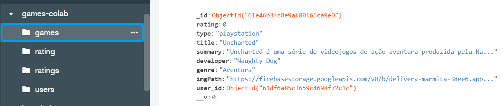

# games-colab-api

<h4 align="center">
    :computer: Sistema colaborativo para cadastro de games, consoles e hates de games.
</h4>

<p align="center">
    <a href="#-projeto">Projeto</a>&nbsp;&nbsp;&nbsp;|&nbsp;&nbsp;&nbsp;
    <a href="#rocket-tecnologias">Tecnologias</a>&nbsp;&nbsp;&nbsp;|&nbsp;&nbsp;&nbsp;
    <a href="#user-content-clipboard-instruções">Instruções</a>&nbsp;&nbsp;&nbsp;|&nbsp;&nbsp;&nbsp;
    <a href="#-ajustes-e-melhorias">Melhorias</a>
</p>

<div align="center">
    
</div>
 
----
 ## 💻 Projeto

API em ExpressJS. Sistema colaborativo para cadastro de games, consoles e hates de games. Onde após feito o cadastro do usuário é possível colaborar no cadastro de novos games e realizar comentários e dar avaliações sobre os games.

----
## :rocket: Tecnologias

- [Typescript](https://www.typescriptlang.org/)
- [ExpressJS](https://expressjs.com/pt-br/)
- [Mongoose](https://mongoosejs.com/)
- [MongoDB](https://www.mongodb.com/)
- [BcryptJS](https://openbase.com/js/bcryptjs/documentation)
- [Firebase](https://console.firebase.google.com/u/0/?hl=pt-br)
- [MulterJS](https://www.npmjs.com/package/multer)
- [Nodemon](https://www.npmjs.com/package/nodemon)

----
## :clipboard: Instruções

### VARIÁVEIS DE AMBIENTE

- Criar na raiz da pasta do projeto um arquivo `.env` e preencher as informações conforme se encontra no arquivo `.env.example`.

### FIREBASE

- Para que as imagens dos vinhos sejam salvas na nuvem é necessário criar uma conta no firebase storage e definir as variaveis de ambiente do firebase em `.env` e setar a variável de ambiente firebaseActive como true. Para que as imagens sejam salvas localmente basta definir a variável de ambiente firebaseActive como false

### DEPENDÊNCIAS

- No terminal executar o comando para instalar as dependências:

```bash
yarn
```

### START

- Finalizado! Basta agora executar a aplicação backend com o seguinte comando:

```bash
yarn dev
```

- A Api estará rodando na porta conforme definido no arquivo .env em PORT, por padrão utilize
  a porta 4000. `http://localhost:4000`

----
## 📌 Ajustes e melhorias

Até o momento não há nenhuma nova feature para a api

